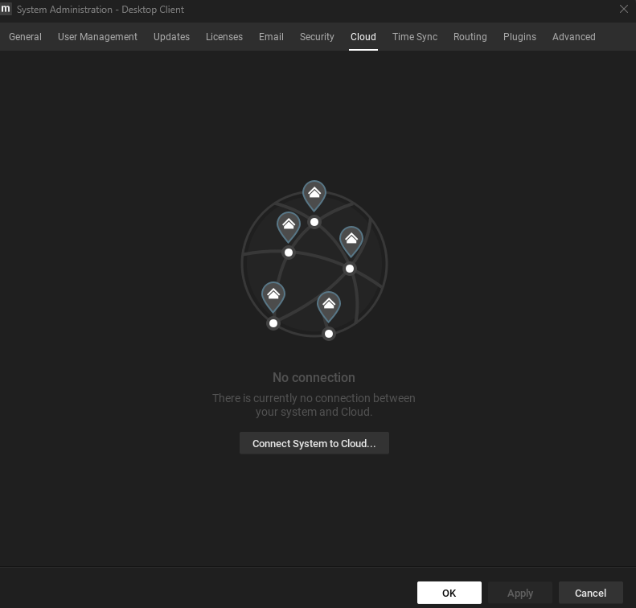

# 1. Install Network Optix

## Getting Started with Network Optix

### Create a Network Optix (Nx) account

Sign up for a Free account at the Nx Meta Dev Portal.

_\* If you have an existing cloud account for a Powered-by-Nx solution, you can log in with your existing cloud credentials._

* Head to [meta.nxvms.com](https://meta.nxvms.com/?\_\_hstc=160140578.ea7aed13702903ff119fcdf2dd699ccd.1700391152756.1700486986707.1700657792908.5&\_\_hssc=160140578.1.1700657792908&\_\_hsfp=725704248)
* Click on [Create Account](https://meta.nxvms.com/register?\_\_hstc=160140578.ea7aed13702903ff119fcdf2dd699ccd.1700391152756.1700486986707.1700657792908.5&\_\_hssc=160140578.1.1700657792908&\_\_hsfp=725704248)
* Verify your email address and sign in.

### Download and install a Nx Meta client&#x20;

A basic Nx Meta platform comprises one or more Nx Meta servers administered through an Nx Meta Meta client. To get started with the Nx AI Manager, we advise you first to install a client on your favorite desktop environment.&#x20;


Ensure you download Nx Meta version 6.0 or later to be able to use the Nx AI Plugin.


If the computer you want to run the client fits the above requirements, you can download and install a Nx Meta client by following the steps below:

* [Download an Nx Meta client by going to this page](https://meta.nxvms.com/download/betas), then continue with the next step.
* A suggested operating system will automatically appear.
* Select your target OS if you want to install the client on an OS different from the autoselected one.
* Download the client package that is most relevant to you.
* Run the installer and follow the installation process.

### Download and install the Nx Meta server on an Ubuntu server

If your Ubuntu device conforms to our requirements, download and set up your first Nx Meta X64 Ubuntu **server** by following the steps below:

*   From a terminal or console window, run the following commands to make sure all dependent packages are installed:\


    ```
    sudo apt update
    sudo apt upgrade -y
    sudo apt-get install -y libgomp1 gdebi wget
    ```
*   Download the [x64 Ubuntu Nx Meta server](https://meta.nxvms.com/download/linux) installer (metavms-server-6.x.x.x-linux\_x64.deb).

    ```
    wget https://updates.networkoptix.com/metavms/38488/linux/metavms-server-6.0.0.38488-linux_x64-beta.deb
    ```
*   Go to the directory where you downloaded the Nx Meta server package and install it:

    ```
    sudo apt install -y ./metavms-server-6.0.0.38488-linux_x64-beta.deb
    ```
* Next, set up the server by using a browser and open the webpage at port :7001 for instance, at `https://localhost:7001/` or  `https://x.x.x.x:7001/` . \
  \
  The webpage will have two buttons. Click the button "Setup New System", enter a System Name, click next. Choose a password. Click next again.\
  \
  .png>)
* Your Nx Meta server can now be added to your Nx Meta client.&#x20;

### Connect to your Nx Meta server with your Nx Meta client

Now that you have an Nx Meta **server** running, go to the desktop machine where you installed your Nx Meta **client** and use the launcher icon to start the client.

<div align="left">

<figure><figcaption></figcaption></figure>

</div>

When the client application has started, you can add the Meta Server installed in the previous step by clicking the "Connect to Server" rectangular button. Or your server has already been discovered, and you can click on the rectangular button with the detected server.&#x20;

In either case, enter the IP address, admin name (default "admin"), and the password you set for the admin user and click next.

<div align="left">

<figure><figcaption></figcaption></figure>

</div>

Your Nx Meta server and Nx Meta client are now connected

### Connect your Nx Meta system with your Nx Cloud account

While the Nx Server and Nx Client can be used offline, to use the NXAI Plugin, your server needs to be connected to an Nx Cloud account. You can do this through the Nx Client.&#x20;

Go to System Administration by right-clicking your system in the left-hand pane of the Nx Client and selecting 'System Administration', then navigate to the 'Cloud' tab.

<figure><figcaption><p>System Administration Cloud Tab</p></figcaption></figure>

Here you can connect your system to your cloud account, which should enable you to use the NXAI Plugin.

### Registering an Nx Meta server through the Nx Meta client

Next, register the server by going to System Administration:

<div align="left">

<figure><figcaption></figcaption></figure>

</div>

.. and then to licenses:

<div align="left">

<figure><figcaption></figcaption></figure>

</div>

Here, you can add your trial or full license.
