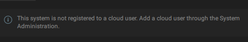
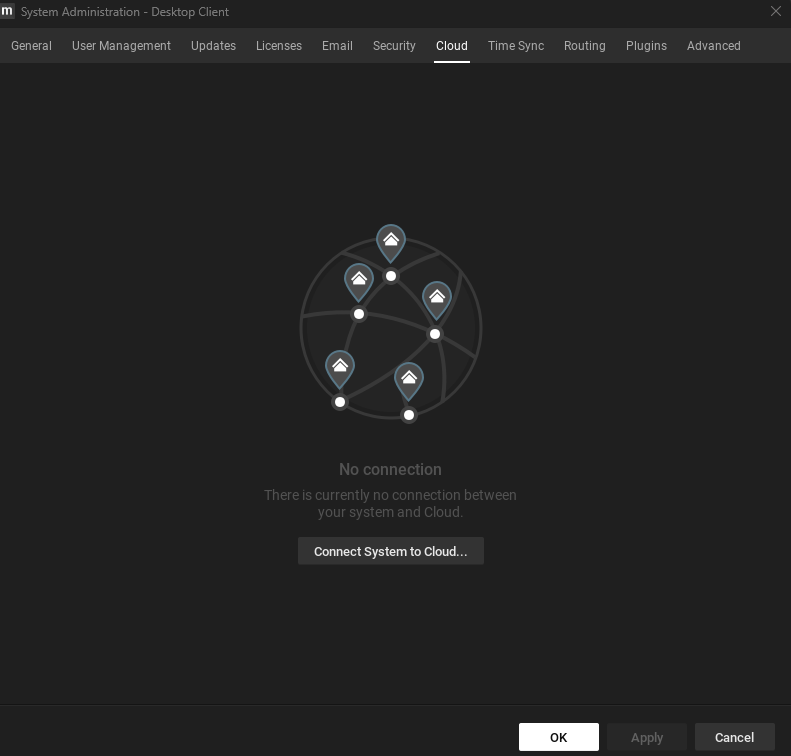
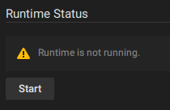
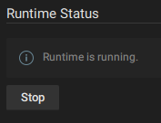
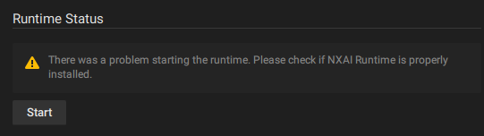

# 6. Troubleshooting

## Plugin is not being Detected


Ensure you download Nx Meta version 6.0 or later to be able to use the Nx AI Plugin.


### Server not restarted

For the plugin to be detected after install, make sure to restart the NX Server. This can be done through the NX Server web interface.&#x20;

Navigate to "\<Server IP Address>:7001" in your web browser. Go to the **Servers** tab, and click the restart button.

### Plugin not installed

It could be the case that the plugin is not properly installed. Follow the instructions at [2.-install-nx-ai-manager-plugin.md](2.-install-nx-ai-manager-plugin.md "mention"), and check that the plugin file is installed at:

`/opt/networkoptix-metavms/mediaserver/bin/plugins/nxai_plugin/libnxai_plugin.so`

If the plugin file is not there, or it exists but the server still cannot detect it, follow the instructions at [4.-manual-plugin-installation.md](4.-manual-plugin-installation.md "mention")

## System not registered to cloud user

If the plugin is detected and you are greeted with this message:

<figure><figcaption></figcaption></figure>

It is most likely that your system is not connected to a cloud account. If you do not have an Nx Cloud account yet, follow the steps at [1.-install-network-optix.md](1.-install-network-optix.md "mention") . The plugin requires a system to be connected to the cloud account to work.

To add your system to your cloud account, right click on your system in the left-hand pane and select the Cloud tab:

<figure><figcaption></figcaption></figure>

Here you can connect your system to your cloud account for the plugin to work.

## Nx AI Manager is not running

The Nx AI Manager plugin sends video frames to the AI Manager runtime, which analyses the input data and returns this analysis. If the Nx AI Manager is not running on the device, then no analysis will be done. The Nx AI Manager can be started with the Nx AI Plugin UI:

<figure><figcaption></figcaption></figure>

Once the NX AI Runtime is running, the following should appear:

<figure><figcaption></figcaption></figure>

## Nx AI Manager cannot be started

If, after clicking Start, the following message appears:

<figure><figcaption></figcaption></figure>

There could be a problem with your installation. Try manually installing the Nx AI Manager [8.1-nx-ai-manager-manual-installation.md](7.-advanced-configuration/8.1-nx-ai-manager-manual-installation.md "mention")

## Nx AI Manager running, but no bounding boxes showing up

If there are no bounding boxes being displayed in the Nx Client, it could point to a problem with the runtime, or driver compatibilities.

For advanced users, it might be advisable to check the output log of the Nx Mediaserver to see if any errors are logged. The log can be gathered by executing:

```
sudo journalctl -u networkoptix-metavms-mediaserver.service > log
```

### Hailo Accelerated Devices

In order for the runtime using Hailo accelerators to work, the correct Hailo Runtime (**hailort)**  needs to be installed. Currently, the NxAI Runtime supports Hailo driver version **4.17.0**. Ensure that the correct runtime is installed.

