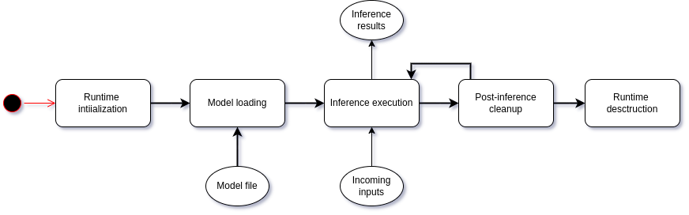

# Specification

Effectively, runtimes are low level interfaces to the XPU that make it possible to:

1. load the “operations’” specific representation,&#x20;
2. and execute it efficiently on your XPU.

### Runtime lifecycle

The lifecycle term is used to refer to the different phases that a runtime goes through during his entire lifetime. \
The runtime's lifecycle consists of 5 consecutive phases starting by initialization and ending with destruction as depicted in the figure below:

<figure><figcaption><p>Runtime lifecycle</p></figcaption></figure>

1. During the initialization step, the runtime is required to establish a connection with the XPU to ensure its usability, as well as initialize all components unrelated to the model.
2. The second stage involves loading the optimized model from a file. At this juncture, the runtime should be capable of executing inference on incoming inputs.
3. Inference run execution: Once the optimized model is loaded, the runtime will be fed incoming inputs one at a time and expected to return output results.
4. After completing each inference run, the runtime proceeds with post-run cleanup tasks. This may involve releasing any temporary resources allocated during the inference process, resetting internal states, or preparing for the next set of inference runs. Subsequently, the runtime either returns to step 3 to continue with further inference execution as necessary, or goes to the final stage.
5. Runtime resources destruction: It ensures that the runtime environment is properly cleaned up and ready for shutdown or further initialization if needed.


Upon failure of one those stages, the runtime should report the issue, preferably, in a human-readable format. This ensures that any encountered errors or issues are clearly communicated, facilitating efficient troubleshooting and resolution by the user or developer.


### Interface

The runtime has to provide an implementation of all functions listed below:

* `runtime_name`: denotes the name of the runtime, serving as a useful identifier to distinguish it from other runtimes within the system.
* `runtime_version`: This parameter signifies the version of the runtime, providing valuable information for tracking and ensuring compatibility with other components or systems.
* `runtime_error_message`: is utilized to retrieve the error message in case of a failure during any of the five stages of the runtime process. It serves as a valuable tool for diagnosing issues and troubleshooting problems encountered during runtime execution.
* `runtime_core_runtime_init`: This stage involves the initialization of the runtime, ensuring all necessary components are properly set up and ready for operation.
* `runtime_core_model_read`: During this stage, the runtime loads the model from storage or memory, preparing it for inference tasks.
* `runtime_core_exec`: In this stage, the runtime executes the inference process, utilizing the loaded model to process input data and generate output predictions.
* `runtime_core_free`: After completing the inference tasks, the runtime performs cleanup operations, releasing any allocated resources and preparing for subsequent executions.
* `runtime_core_finalize`: This stage marks the finalization of the runtime process, where any remaining resources are released, and the runtime environment is shut down gracefully.


A concrete example with C code is provided in the [illustrative example](specification.md#illustrative-example) below.


### IO Definition

The runtime must adhere to a specific format for both the input it receives for inference and the outputs it produces. This ensures that the communicated data is readable by both the runtime itself and the software utilizing it. \
Detailed information regarding these formats will be available later.

### Runtime compilation

The runtime needs to be compiled into a shared library that any software can load and use for accelerating inference.

To ensure compatibility of the runtime with the software, the shared library needs to be cross-compiled using one of the compiler toolchains below, depending on the target hardware: X86-64, Arm64, Arm32 CPU architectures.

Below are links to the compiler toolchain used for each architecture:

* X86-64: [download](https://download.sclbl.net/toolchains/x86\_64-unknown-linux-gnu-gcc-9.5.0.tar.gz).
* Arm64: [download](https://download.sclbl.net/toolchains/gcc-arm-9.2-2019.12-x86\_64-aarch64-none-linux-gnu.tar.gz).
* Arm32: [download](https://download.sclbl.net/toolchains/armv7-rpi2-linux-gnueabihf.tar.gz).

### Illustrative example

Below are code snippets illustrating a runtime implementation that aligns with the aforementioned interface. Additionally, a program is included that loads the runtime's shared library and simulate the lifecycle as described earlier.

<details>

<summary>Interface</summary>

```cpp
#include <stddef.h>

/**
 * @brief This function is called only once to initialize the runtime environment.
 * 
 * @param acceleration An integer that represents the acceleration type. 0 for CPU, 1 for XPU.
 * @param runtime_count The number of parallel runtimes to be used.
 * @return 0 if the initialization is successful, and non-zero otherwise.
 */
int runtime_core_runtime_init(int acceleration,int runtime_count);

/**
 * @brief This function is called to load the model from the file path.
 * 
 * @param file_path The path to the model file.
 * @return 0 if the model is loaded successfully, and non-zero otherwise.
 */
int runtime_core_model_read(const char *file_path);

/**
 * @brief This function is called to execute the model with the input message.
 * 
 * @param input_packed_message The input message in packed format. This is allocated by the caller, and it should not be deallocated by the shared library.
 * @param input_message_length The length of the input message.
 * @param output_packed_message The output message in packed format. This should be allocated by the shared library, and proper deallocation should be handled by the library once `runtime_core_free` is called.
 * @param output_message_length The length of the output message.
 * @return 0 if the execution is successful, and non-zero otherwise.
 */
int runtime_core_exec(const char *input_packed_message, size_t input_message_length, char **output_packed_message, size_t* output_message_length);

/**
 * @brief This function is called after each inference run to clean up the output packed message and any other resources.
 * 
 * @return 0 if the cleanup is successful, and non-zero otherwise.
 */
int runtime_core_free();

/**
 * @brief This function is called to destroy the runtime environment after the inference process is stopped.
 * 
 * @return 0 if the finalization is successful, and non-zero otherwise. 
 */
int runtime_core_finalize();

/**
 * @brief This function is called to get the error message in case of a runtime error.
 * 
 * @return The error message in a human-readable format. This should be allocated by the shared library, and proper deallocation should be handled by the library.
 */
const char *runtime_error_message();

/**
 * @brief This function is called to get the version of the shared library.
 * 
 * @return The version of the shared library. This should be allocated by the shared library, and proper deallocation should be handled by the library.
 */
const char *runtime_version();

/**
 * @brief This function is called to get the name of the shared library.
 * 
 * @return The name of the shared library. This should be allocated by the shared library, and proper deallocation should be handled by the library.
 */
const char *runtime_name();
```

</details>

<details>

<summary>Runtime Implementation</summary>

```c
#include "interface.h"
#include <stdlib.h>
#include <stdio.h>
#include <stdbool.h>
#include <string.h>
#include <time.h>

static const char *_runtime_name ="ExampleRuntime";
static const char *_runtime_version = "0.1.0";
static char *_error_message = NULL;
static char *_output_packed_message = NULL;
static size_t _output_message_length = 0;

// Helper function to raise an error randomly to simulate an occasional runtime error
static int raise_error(){
    int r = rand();
    if (r % 10 == 0)
        return 1;
    else
        return 0;
}
// Helper function to build the error message object from a string
static void build_error_message(const char *error_message){
    _error_message = (char *)malloc(strlen(error_message));
    strcpy(_error_message, error_message);
}

const char *runtime_name(){
    return _runtime_name;
}

const char *runtime_version(){
    return _runtime_version;
}

const char *runtime_error_message(){
    return _error_message;
}


int runtime_core_runtime_init(int acceleration,int runtime_count){
    srand(time(NULL)); // Seed the random number generator

    printf("Initializing the runtime environment\n");
    printf("Acceleration type: %d\n", acceleration);
    printf("Runtime count: %d\n", runtime_count);
    if (raise_error()){
        build_error_message("Failed to initialize the runtime environment");
        return 1;
    }
    return 0;
}

int runtime_core_model_read(const char *file_path){
    printf("Loading the model from the file path: %s\n", file_path);
    if (raise_error()){
        build_error_message("Failed to load the model");
        return 1;
    }
    return 0;
}

int runtime_core_exec(const char *input_packed_message, size_t input_message_length, char **output_packed_message, size_t* output_message_length){
    printf("Executing the model with the input message\n");
    printf("Input message: %.10s\n", input_packed_message);
    printf("Input message length: %zu\n", input_message_length);

    // Create a dummy output message
    size_t output_length = 10;
    _output_packed_message = (char *)malloc(output_length);
    if(raise_error()){
        build_error_message("Failed to parse the input message");
        return 1;
    }

    if(raise_error()){
        build_error_message("Failed to run inference with the input message");
        return 2;
    }

    memset(_output_packed_message, 'a', output_length);
    _output_message_length = output_length;

    // Set the output message and its length
    *output_packed_message = _output_packed_message;
    *output_message_length = _output_message_length;

    return 0;
}

int runtime_core_free(){
    printf("Cleaning up the output packed message and any other resources\n");
    if (_output_packed_message != NULL){
        free(_output_packed_message);
        _output_packed_message = NULL;
        _output_message_length = 0;
    }
    return 0;
}

int runtime_core_finalize(){
    printf("Destroying the runtime environment\n");
    // Clean up the output packed message
    runtime_core_free();

    // Clean up the error message
    if (_error_message != NULL){
        free(_error_message);
        _error_message = NULL;
    }
    return 0;
}
```

</details>

<details>

<summary>Main Program</summary>

```c
#include <dlfcn.h>
#include <stdio.h>
#include <unistd.h>

typedef int (*runtime_core_runtime_init_t)(int, int);
typedef int (*runtime_core_model_read_t)(const char *);
typedef int (*runtime_core_exec_t)(const char *, size_t, char **, size_t *);
typedef int (*runtime_core_free_t)();
typedef int (*runtime_core_finalize_t)();
typedef const char *(*runtime_error_message_t)();
typedef const char *(*runtime_version_t)();
typedef const char *(*runtime_name_t)();

void print_error_message(const char *error_message) {
    fprintf(stderr, "Error: %s\n", error_message);
}

int main() {
    void *handle;
    handle = dlopen("./libRuntimeLibrary.so", RTLD_NOW);
    if (!handle) {
        print_error_message(dlerror());
        return 1;
    }

    runtime_core_runtime_init_t runtime_core_runtime_init = (runtime_core_runtime_init_t)dlsym(handle, "runtime_core_runtime_init");
    runtime_core_model_read_t runtime_core_model_read = (runtime_core_model_read_t)dlsym(handle, "runtime_core_model_read");
    runtime_core_exec_t runtime_core_exec = (runtime_core_exec_t)dlsym(handle, "runtime_core_exec");
    runtime_core_free_t runtime_core_free = (runtime_core_free_t)dlsym(handle, "runtime_core_free");
    runtime_core_finalize_t runtime_core_finalize = (runtime_core_finalize_t)dlsym(handle, "runtime_core_finalize");
    runtime_error_message_t runtime_error_message = (runtime_error_message_t)dlsym(handle, "runtime_error_message");
    runtime_version_t runtime_version = (runtime_version_t)dlsym(handle, "runtime_version");
    runtime_name_t runtime_name = (runtime_name_t)dlsym(handle, "runtime_name");

    if (!runtime_core_runtime_init || !runtime_core_model_read || !runtime_core_exec || !runtime_core_free || !runtime_core_finalize || !runtime_error_message || !runtime_version || !runtime_name) {
        print_error_message(dlerror());
        dlclose(handle);
        return 1;
    }

    // print runtime name and version
    const char *name = runtime_name();
    const char *version = runtime_version();
    printf("Runtime name: %s, version: %s\n", name, version);

    // initialize runtime environment
    int acceleration = 1;
    int runtime_count = 1;
    
    if (runtime_core_runtime_init(acceleration, runtime_count)) {
        print_error_message(runtime_error_message());
        dlclose(handle);
        return 1;
    }

    // load model
    const char *file_path = "model.onnx";
    if (runtime_core_model_read(file_path)) {
        print_error_message(runtime_error_message());
        dlclose(handle);
        return 1;
    }

    // execute model
    while(1){
        const char *input_packed_message = "input";
        size_t input_message_length = 5;
        char *output_packed_message;
        size_t output_message_length;
        if (runtime_core_exec(input_packed_message, input_message_length, &output_packed_message, &output_message_length)) {
            print_error_message(runtime_error_message());
            dlclose(handle);
            return 1;
        }

        sleep(1); // Simulate the inference process

        printf("Output message: %s\n", output_packed_message);

        // free output message
        if (runtime_core_free()) {
            print_error_message(runtime_error_message());
            dlclose(handle);
            return 1;
        }
    }

    // finalize runtime environment
    if (runtime_core_finalize()) {
        print_error_message(runtime_error_message());
        dlclose(handle);
        return 1;
    }


    dlclose(handle);

    return 0;
}
```

</details>

<details>

<summary>Compilation file</summary>

Note that you may need to rename the C files: `example_program.c`, `example_backend.c` and `interface.h`.

```cmake
cmake_minimum_required(VERSION 3.10.2)
project(example)

# Shared Library
add_library(RuntimeLibrary SHARED example_backend.c)
# Include the interface file: interface.h
target_include_directories(RuntimeLibrary PUBLIC .)

# Main Program
add_executable(example example_program.c)
```

</details>
