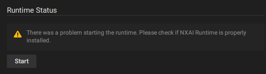

# Q\&A

## I don't see any bounding boxes in the Nx Client

First make sure that the model actually has something to detect. For example if you're using a model that is expecting vehicles, that will not be detected on a camera that is viewing an empty warehouse.

If the camera actually sees something that should be detected you can check if the objects view is active. If the notifications or another tab is active the bounding boxes will not be displayed.

<figure><figcaption></figcaption></figure>

When you switch to the objects tab the bounding boxes should show up.

<figure><figcaption></figcaption></figure>

If there are still no bounding boxes, please go through the [plugin checks](plugin-checks.md), [system checks](system-checks.md) and [things to try](things-to-try.md) sections to solve the problem.

## The Nx AI Manager cannot be started

If, after clicking Start, the following message appears:

<figure><figcaption></figcaption></figure>

There could be a problem with your installation. Try manually installing the Nx AI Manager [nx-ai-manager-manual-installation.md](../../nx-ai-manager/advanced-configuration/nx-ai-manager-manual-installation.md "mention")

If there are no bounding boxes being displayed in the Nx Client, it could point to a problem with the runtime, or driver incompatibilities. It can also mean that the model is not picking up any useful data.

## How can I check if the Metadata is generated

> I noticed that plugin stops generating metadata for some reason Is there any log or additional information I can collect for you so it would be useful in this case?

For advanced users, it might be advisable to check the output log of the Nx Mediaserver to see if any errors are logged. The log can be gathered by executing:

```
sudo journalctl -u networkoptix-metavms-mediaserver.service
```

## Is it possible to send output to a different endpoint?

No this is not possible. It is possible to access the data and pass it through.


TODO: show how to do that


## Does the AI Manager work with any video

The AI Manager works with any video input stream, but the results may vary.

Videos in portrait mode will get black bars added to the sides to fill up the image, and very widescreen videos will get black bars added to the top and bottom. The effective area for detection will be smaller in those cases, which will affect the accuracy of the results.

## Why isn't every model converted to all supported formats?

Not every input model can be converted to all target formats, for instance, tflite only allows static IO, both at graph and operator level.&#x20;

If an uploaded model makes use of, for instance, dynamic IO, it cannot be converted to tflite.&#x20;

Most new hardware accelerators are severely limited in the models they can run, despite often claiming to run "all common models" or something along those lines.

The files you see there are the artifacts that are generated by the different conversion blocks that we have in our conversion server, in addition to the original file that was uploaded by the user.
