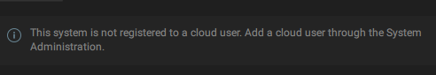
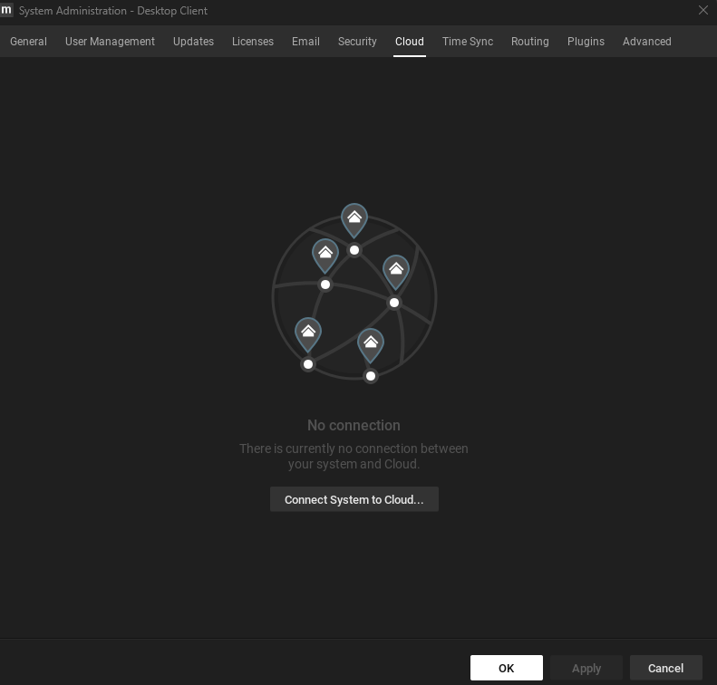

# System checks

## Is Nx Meta version 6.0 or later installed

You need Nx Meta 6.0 or later for the Nx AI Manager plugin. Follow the instructions to see [how to install](../../nx-ai-manager/install-network-optix.md).

You can download [the latest version](https://meta.nxvms.com/download/releases) from the Nx Meta resources.

You need both the client and server programs, but the server can be installed on another machine than the client.&#x20;

Typically the **server** is a computer connected to some **cameras** over the network, and the **client** can be installed on your **local workstation** or **laptop**.

## Is the storage full

Can you store data or is the system low on resources. If the system has no space left the Nx AI Manager will not work correctly.

## Is the camera working

Do you see images in the camera preview window?

If not, check the camera control app that came with the camera if that does show images.&#x20;

* If the camera is not working there, you need to fix the camera input first before trying any next steps.
* If the camera is working but not visible in Nx Meta, please try to fix the camera display in Nx Meta first before trying any next steps.

## Are the needed drivers installed

### NVIDIA Orin accelerated

If you're running on NVIDIA Orin - is a current version of NVIDIA Jetpack installed?&#x20;

### Hailo Accelerated Devices

In order for the runtime using Hailo accelerators to work, the correct Hailo Runtime (**hailort)**  needs to be installed. Currently, the Nx AI Runtime supports Hailo driver version **4.17.0**. Ensure that the correct runtime is installed.

## Is the system registered to a cloud user

If the plugin is detected and you are greeted with this message:

<figure><figcaption></figcaption></figure>

It is most likely that your system is not connected to a cloud account. If you do not have an Nx Cloud account yet, follow the steps at [install-network-optix.md](../../nx-ai-manager/install-network-optix.md "mention") . The plugin requires a system to be connected to the cloud account to work.

To add your system to your cloud account, right click on your system in the left-hand pane and select the Cloud tab:

<figure><figcaption></figcaption></figure>

